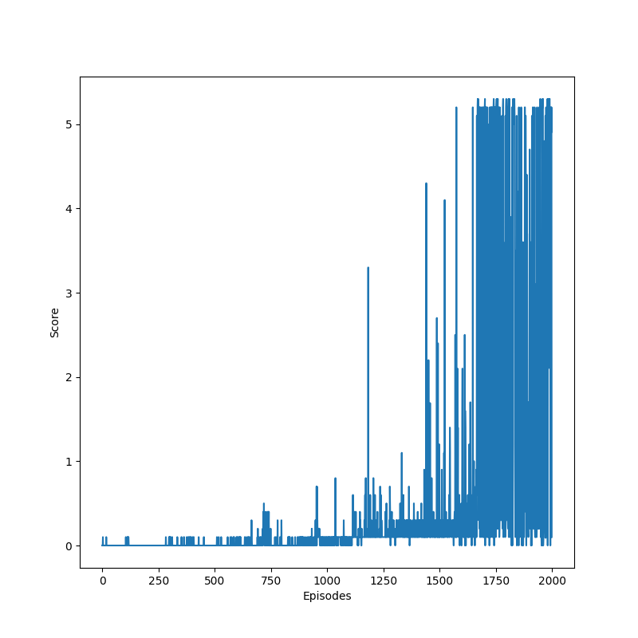

# Report

Two agents are able to solve the environment in ```2004 episodes```. The implementation is adapted from the ddpg repository. 

## Learning Algorithm 
The [MADDPG algorithm](https://papers.nips.cc/paper/7217-multi-agent-actor-critic-for-mixed-cooperative-competitive-environments.pdf) was used. The baseline DDPG implementation consists of training loop, agent and replay buffer. The implementation was amended by adding compatibility with two agents. MADDPG differs from DDPG in the way how the information is given to critics, that is they receive all observations from each agent.

### Model

Two types of the deep neural network were used: actor and critic models.

The actor architecture is based on 4 fully connected layers.

* FullyConnected shape: <state_size, 128>
* FullyConnected shape: <128, 256>
* FullyConnected shape: <256, 128>
* FullyConnected shape: <128, action_size>

The critic architecture is similar:

* FullyConnected shape: <state_size * 2, 256>
* FullyConnected shape: <256 + action_size * 2, 256>
* FullyConnected shape: <256, 128>
* FullyConnected shape: <128, 1>

For this project state_size is equal to ```24```, and action size is equal to ```2```. The ReLU and LeakyReLu functions were used as activation for the actor and critic models respectively.

### Optimizer
To optimize the weights of the models the agent uses Adam algorithm. Ornstein-Uhlenbeck noise is scaled by the factor 0.1 compared to the standard ddpg implementation. During training the update is being applied every timestamp. Each reward is scaled by a factor of 100, this helps speed up training.

### Hyperparameters
All hyperparameters are stored at the top of the maddpg_agent.py file. All of them are listed below.

PARAMETER  | Description | Default value
------------ | -------------| -------------|
GAMMA  | Discount factor | 0.99
TAU  | Controls soft update of a target network| 1e-3
BATCH_SIZE  | Batch size | 128
BUFFER_SIZE   | Replay buffer size | 2e5
LR_ACTOR   | Learning rate of the actor model | 1e-4
LR_CRITIC   | Learning rate of the critic model | 4e-4
UPDATE_EVERY   | How often turn on learning | 1
UPDATES   | How many updates during learning | 1

## Results
The weights are saved in files ```checkpoint_actor_A.pt```, ```checkpoint_critic_A.pt```, ```checkpoint_actor_B.pt```, ```checkpoint_critic_B.pt```. The task was solved in ```2004``` episodes. Best average score over 100 consecutive episodes is ```3.14```. The scores are plotted below. 



```Logs from the terminal:```
```


Vector Observation space size (per agent): 8
Number of stacked Vector Observation: 3
Vector Action space type: continuous
Vector Action space size (per agent): 2
Vector Action descriptions: , 

Episode 100     Average Score: 0.00     Time: 0.22
Episode 200     Average Score: 0.00     Time: 0.24
Episode 300     Average Score: 0.00     Time: 0.22
Episode 400     Average Score: 0.00     Time: 0.22
Episode 500     Average Score: 0.00     Time: 0.23
Episode 600     Average Score: 0.00     Time: 0.22
Episode 700     Average Score: 0.01     Time: 0.23
Episode 800     Average Score: 0.01     Time: 0.22
Episode 900     Average Score: 0.04     Time: 0.23
Episode 1000    Average Score: 0.00     Time: 0.24
Episode 1100    Average Score: 0.00     Time: 0.23
Episode 1200    Average Score: 0.00     Time: 0.23
Episode 1300    Average Score: 0.05     Time: 0.49
Episode 1400    Average Score: 0.11     Time: 1.79
Episode 1500    Average Score: 0.11     Time: 0.47
Episode 1600    Average Score: 0.11     Time: 0.53
Episode 1700    Average Score: 0.18     Time: 0.49
Episode 1800    Average Score: 0.20     Time: 0.85
Episode 1900    Average Score: 0.22     Time: 0.88
Episode 2000    Average Score: 0.43     Time: 8.355
Episode 2004    Average Score: 0.53     Time: 16.56
Environment solved in 2004 episodes!    Average Score: 0.53
Episode 2100    Average Score: 2.16     Time: 6.022
Episode 2150    Average Score: 3.14     Time: 16.82
Best average score: 3.1410000468045474
```
## Ideas for Future Work

There are many other potential algorithms that can solve the task. My plans are listed below:

- Try different noise parameters.
- Try PPO algorithm.
- Limit the number of timestamps in the episode. 
